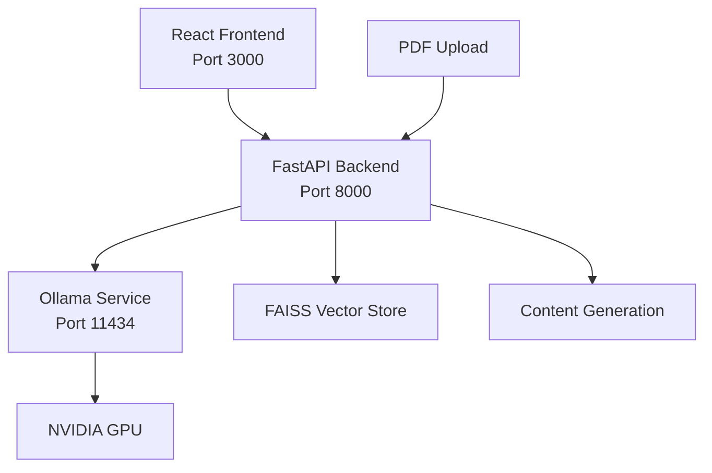

# 🧞‍♂️ LangGenie - AI-Powered Content Generator

[](https://opensource.org/licenses/MIT)
[](https://docker.com)
[](https://nvidia.com)

**LangGenie** is an AI-powered research platform that transforms PDF documents into engaging content. Upload your PDFs and generate speeches, articles, blog posts, or get instant Q&A responses using the power of LLaMA 3.1 with GPU acceleration.


## ✨ Features

### 🎨 Modern UI/UX
- **Glassmorphism Design** - Beautiful glass-like interface with backdrop blur
- **Gradient Backgrounds** - Stunning purple-to-blue animated gradients
- **Smooth Animations** - Framer Motion powered interactions
- **Mobile Responsive** - Works perfectly on all devices
- **Dark Theme** - Eye-friendly modern dark interface

### 🚀 AI Content Generation
- **📝 Q&A Mode** - Ask questions about your documents
- **🎤 Speech Generator** - Create engaging speeches from content
- **📰 Article Writer** - Generate comprehensive articles
- **✍️ Blog Creator** - Write conversational blog posts

### ⚡ Technical Features
- **GPU Acceleration** - NVIDIA GPU support for faster inference
- **RAG Pipeline** - Retrieval-Augmented Generation for accurate responses
- **Vector Search** - FAISS-powered semantic search
- **Docker Support** - Easy deployment with Docker Compose

## 🛠️ Prerequisites

Before running LangGenie, ensure you have the following installed:

### Required Software
- **Docker Desktop** (with WSL2 backend for Windows)
- **Docker Compose** (usually included with Docker Desktop)
- **NVIDIA GPU** (optional but recommended for performance)
- **NVIDIA Drivers** (latest version)

### System Requirements
- **OS**: Windows 10/11, macOS, or Linux
- **RAM**: 8GB minimum, 16GB recommended
- **Storage**: 10GB free space
- **GPU**: NVIDIA GPU with 6GB+ VRAM (for GPU acceleration)

### For Windows Users
1. **Docker Desktop**: Download from [Docker Official Site](https://www.docker.com/products/docker-desktop/)
2. **WSL2**: Enable Windows Subsystem for Linux 2
3. **NVIDIA Drivers**: Install latest drivers from [NVIDIA](https://www.nvidia.com/drivers/)

## 🚀 Quick Start

### Method 1: One-Click Installation (Recommended)

#### For Windows:
```cmd
# Download and run the installer
install.bat
```

#### For Linux/macOS:
```bash
# Make the script executable and run
chmod +x install.sh
./install.sh
```

### Method 2: Manual Installation

#### 1. Clone the Repository

```bash
git clone https://github.com/your-username/LangGenie.git
cd LangGenie
```

#### 2. Environment Setup

No additional environment configuration needed! All dependencies are handled by Docker.

#### 3. Start the Application

```bash
# Start all services
docker-compose up -d

# View logs (optional)
docker-compose logs -f
```

### 4. Access the Application

Once the containers are running:

- **Frontend**: [http://localhost:3000](http://localhost:3000)
- **Backend API**: [http://localhost:8000](http://localhost:8000)
- **Ollama Service**: [http://localhost:11434](http://localhost:11434)

## 📋 Usage Guide

### Step 1: Upload Your PDF
1. Navigate to [http://localhost:3000](http://localhost:3000)
2. Click on "DocQnA & Content Generator" or go to `/rag`
3. Upload your PDF document using the file upload component

### Step 2: Select Content Type
Choose from four AI-powered generation modes:

| Mode | Icon | Description | Use Case |
|------|------|-------------|----------|
| **Q&A** | 💬 | Ask questions about your document | Research, fact-finding |
| **Speech** | 🎤 | Generate engaging speeches | Presentations, talks |
| **Article** | 📰 | Create comprehensive articles | Technical writing, reports |
| **Blog** | ✍️ | Write conversational blog posts | Content marketing, education |

### Step 3: Generate Content
1. Type your request in the input field
2. Click the send button or press Enter
3. Wait for AI to process and generate your content

### Example Prompts

#### Q&A Mode
```
"What are the main findings of this research?"
"Summarize the methodology used in this study"
"What are the limitations mentioned?"
```

#### Speech Mode
```
"Create a 5-minute motivational speech about innovation"
"Generate a conference presentation on the key findings"
"Write an opening speech for a technical workshop"
```

#### Article Mode
```
"Write a comprehensive article explaining the research methodology"
"Create a technical review of the findings"
"Generate an analysis article on the implications"
```

#### Blog Mode
```
"Write an engaging blog post about practical applications"
"Create a beginner-friendly explanation of the concepts"
"Generate a thought-leadership piece on the topic"
```

## 🔧 Advanced Configuration

### GPU Acceleration Setup

LangGenie automatically detects and uses NVIDIA GPUs when available.

#### Verify GPU Access
```bash
# Check if GPU is accessible in Ollama container
docker exec langgenie-ollama-1 nvidia-smi
```

#### Expected Output
```
+-----------------------------------------------------------------------------+
| NVIDIA-SMI 580.88       Driver Version: 580.88       CUDA Version: 13.0  |
|-------------------------------+----------------------+----------------------+
| GPU  Name                     | Memory-Usage         | GPU-Util             |
|===============================+======================+======================|
|   0  NVIDIA GeForce RTX 3070  |   5393MiB /  8192MiB |     0%               |
+-----------------------------------------------------------------------------+
```

### Custom Model Configuration

To use different Ollama models:

1. **Modify the backend**:
   ```python
   # In backend/source/rag.py
   self.embeddings = OllamaEmbeddings(
       model="your-model-name",  # Change this
       base_url="http://ollama:11434"
   )
   ```

2. **Update the Ollama script**:
   ```bash
   # In ollama/pull-llama3.sh
   ollama pull your-model-name
   ```

3. **Rebuild containers**:
   ```bash
   docker-compose build --no-cache
   docker-compose up -d
   ```

## 🐳 Docker Commands Reference

### Basic Operations
```bash
# Start all services
docker-compose up -d

# Stop all services
docker-compose down

# View running containers
docker-compose ps

# View logs
docker-compose logs -f [service-name]

# Rebuild containers
docker-compose build --no-cache

# Restart a specific service
docker-compose restart [service-name]
```

### Service Names
- `ollama` - AI model service
- `backend` - FastAPI backend
- `app` - React frontend

### Debugging
```bash
# Access container shell
docker exec -it langgenie-backend-1 bash
docker exec -it langgenie-ollama-1 bash

# Check container logs
docker-compose logs backend
docker-compose logs app
docker-compose logs ollama

# Monitor resource usage
docker stats
```

## 🏗️ Architecture Overview



### Component Details

| Component | Technology | Purpose |
|-----------|------------|----------|
| **Frontend** | React + TypeScript + Tailwind | Modern UI with glassmorphism design |
| **Backend** | FastAPI + Python | API server and RAG pipeline |
| **AI Model** | Ollama + LLaMA 3.1 | Language model inference |
| **Vector DB** | FAISS | Document embeddings and retrieval |
| **GPU** | NVIDIA CUDA | Accelerated AI inference |

## 🔍 Troubleshooting

### Common Issues

#### 1. GPU Not Detected
**Problem**: Ollama not using GPU
**Solution**:
```bash
# Check GPU support
nvidia-smi

# Verify Docker GPU support
docker run --rm --gpus all nvidia/cuda:12.0-base-ubuntu20.04 nvidia-smi

# Restart with GPU support
docker-compose down
docker-compose up -d
```

#### 2. Frontend Not Loading
**Problem**: Cannot access localhost:3000
**Solution**:
```bash
# Check container status
docker-compose ps

# Check frontend logs
docker-compose logs app

# Restart frontend
docker-compose restart app
```

#### 3. Backend API Errors
**Problem**: 500/400 errors from backend
**Solution**:
```bash
# Check backend logs
docker-compose logs backend

# Restart backend
docker-compose restart backend

# Check if Ollama is ready
docker-compose logs ollama
```

#### 4. Model Loading Issues
**Problem**: Ollama model not loaded
**Solution**:
```bash
# Check Ollama status
docker exec langgenie-ollama-1 ollama list

# Manually pull model
docker exec langgenie-ollama-1 ollama pull llama3.1

# Restart Ollama service
docker-compose restart ollama
```

#### 5. Port Conflicts
**Problem**: Ports 3000, 8000, or 11434 already in use
**Solution**:
1. Stop conflicting services
2. Or modify `docker-compose.yml` to use different ports:
   ```yaml
   ports:
     - "3001:80"  # Frontend on port 3001
     - "8001:8000"  # Backend on port 8001
   ```

## 📊 Performance Tips

### For Better Performance
1. **Use GPU**: Ensure NVIDIA GPU is properly configured
2. **Increase Memory**: Allocate more RAM to Docker Desktop
3. **SSD Storage**: Use SSD for Docker volumes
4. **Close Unused Apps**: Free up system resources

### Memory Requirements by Model
| Model | VRAM Required | RAM Required |
|-------|---------------|---------------|
| LLaMA 3.1 7B | 6GB+ | 8GB+ |
| LLaMA 3.1 13B | 12GB+ | 16GB+ |
| LLaMA 3.1 70B | 48GB+ | 64GB+ |

## 🤝 Contributing

We welcome contributions! Please follow these steps:

1. Fork the repository
2. Create a feature branch: `git checkout -b feature-name`
3. Commit changes: `git commit -am 'Add feature'`
4. Push to branch: `git push origin feature-name`
5. Submit a Pull Request

### Development Setup
```bash
# Clone your fork
git clone https://github.com/your-username/LangGenie.git

# Install frontend dependencies (for development)
cd frontend
npm install
npm run dev

# Install backend dependencies (for development)
cd ../backend
pip install -r dev_requirements.txt
uvicorn main:app --reload
```

## 📄 License

This project is licensed under the MIT License - see the [LICENSE](LICENSE) file for details.

## 🙏 Acknowledgments

- **Ollama** - For providing easy LLM deployment
- **Meta** - For the LLaMA models
- **OpenAI** - For inspiring the conversational AI approach
- **Tailwind CSS** - For the utility-first CSS framework
- **Framer Motion** - For smooth animations

## 📞 Support

If you encounter any issues or have questions:

1. Check the [Troubleshooting](#-troubleshooting) section
2. Search existing [GitHub Issues](https://github.com/your-username/LangGenie/issues)
3. Create a new issue with detailed information
4. Join our [Discord Community](https://discord.gg/your-invite)

## 🗺️ Roadmap

- [ ] **Multi-language Support** - Support for different languages
- [ ] **More AI Models** - Integration with Claude, GPT-4, etc.
- [ ] **Collaboration Features** - Share and collaborate on documents
- [ ] **API Keys** - Support for cloud-based AI services
- [ ] **Advanced Analytics** - Usage statistics and insights
- [ ] **Mobile App** - Native mobile applications

---

**Made with ❤️ by the LangGenie Team**

*Transform your documents, unleash your creativity!*
